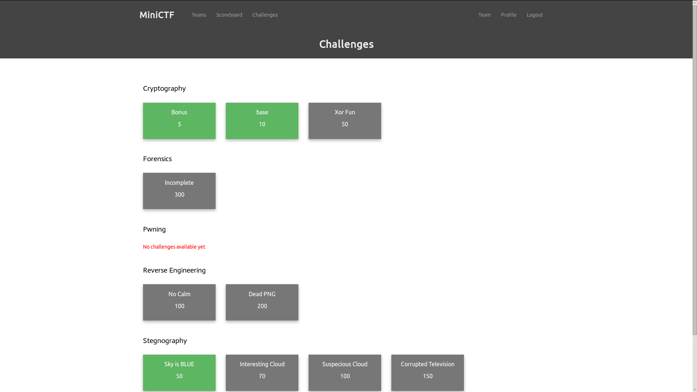
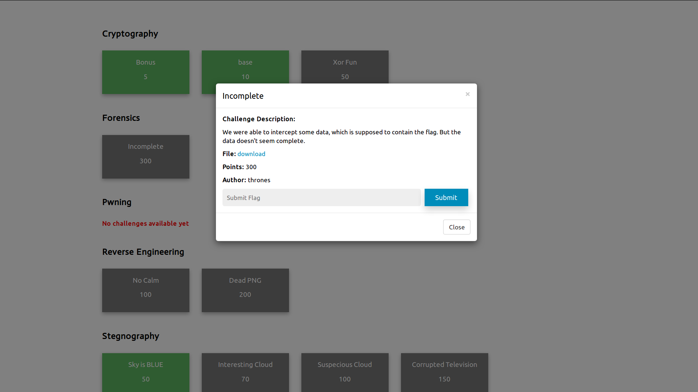
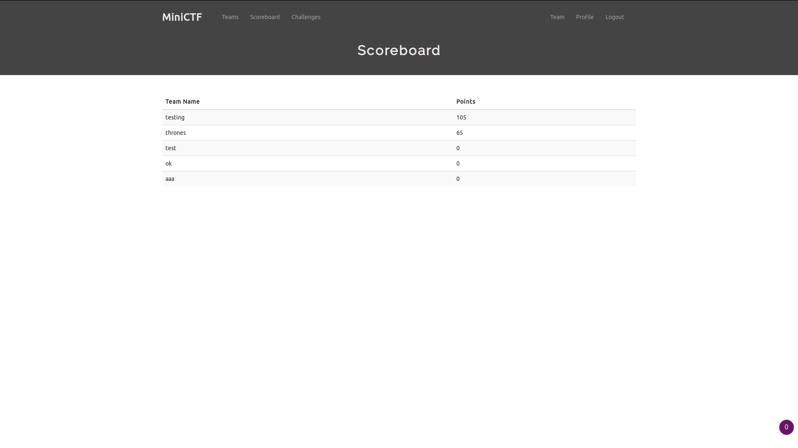
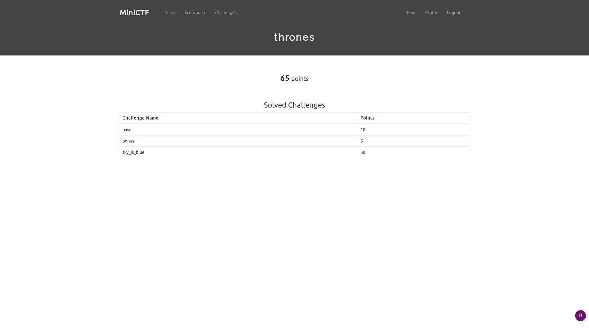
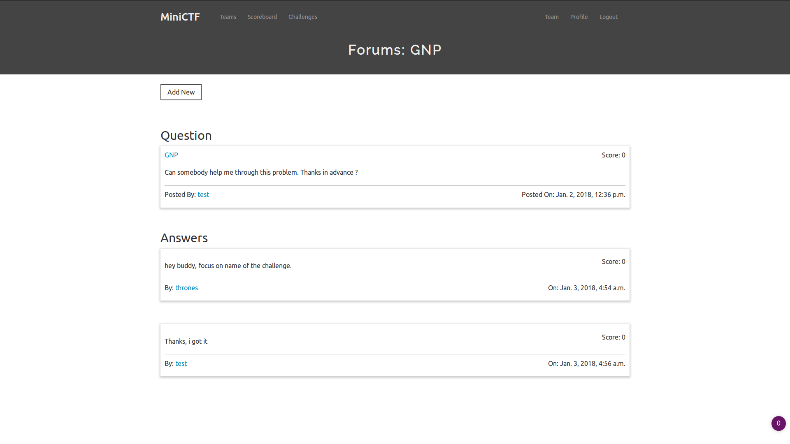

# MINICTF

### A platform build in django for hosting CTF events.

#### FEATURES :

- Cool Interface
- Score Board
- Responsive Design
- Password Change Support
- Discussion Forums
- and a lot more.

#### SCREENSHOTS :

Challenge Page



Challenge View



Score Board



Team Details



Discussion Forums



#### Dev env setup

##### Requirments

> Rename .env.example to .env and change the value of KEY.
>
> **Note**: Keep this value a secret.

###### Docker Setup

```bash
  make docker_build
  make docker_run
```

This will start the server at port 8000.

###### Local Setup

```
python 3.x
django 2.0
```

Install [Pipenv](https://pypi.org/project/pipenv/)

<b>Want to make this process fast. Switch to [local branch](https://github.com/0xhackie/hackerspace.git)</b>

###### Install miniCTF

```bash
  git clone https://github.com/0xhackie/hackerspace.git
  pipenv shell
  pipenv install
  python manage.py makemigrations accounts challenges forums
  python manage.py migrate
  python manage.py runserver
```

Then register or create superuser and add challenges.
